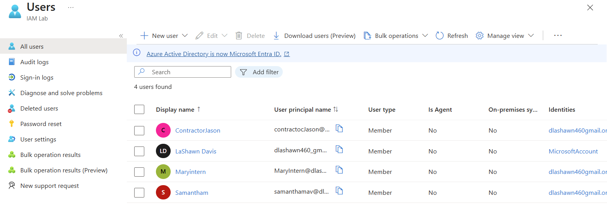
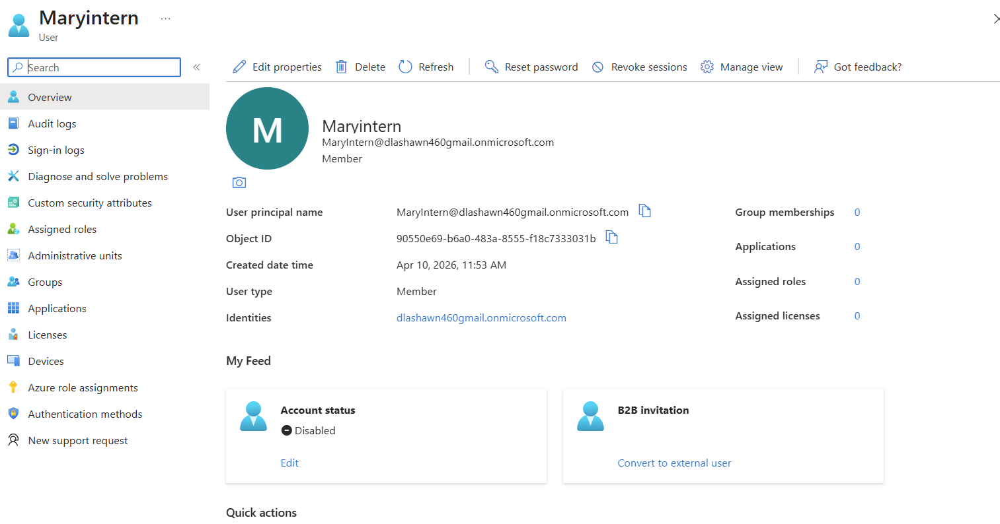
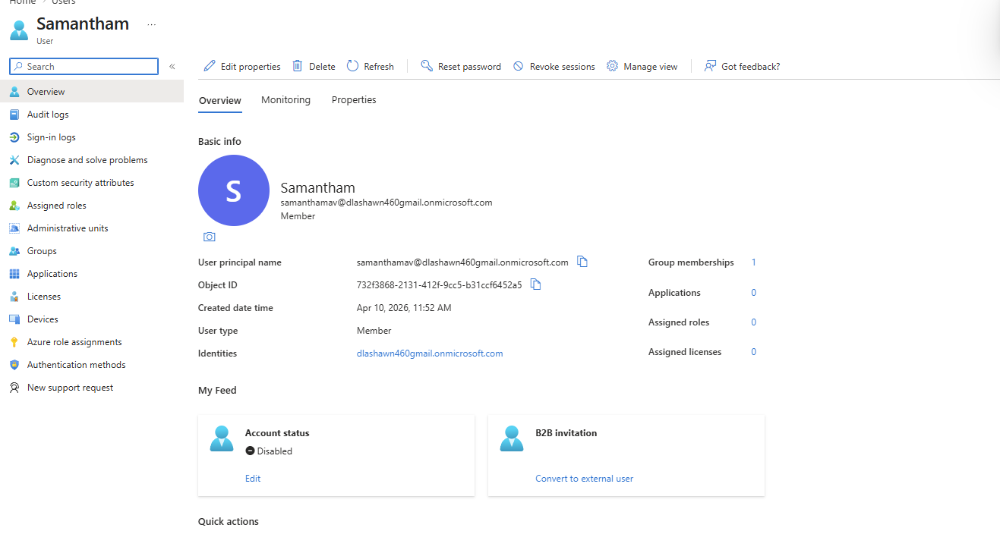

# IAM Hands-On Lab Portfolio — Microsoft Entra ID

This repository documents hands-on Identity and Access Management (IAM) labs performed using Microsoft Entra ID.

The goal is to build real-world IAM experience including:
- User lifecycle management
- Group-based access control
- Role-Based Access Control (RBAC)
- Multi-Factor Authentication (MFA)
- Conditional Access concepts

Each lab simulates enterprise IAM scenarios and includes documentation with screenshots for validation.

# Lab 01 — User Lifecycle Management

## Objective
Simulate employee onboarding and offboarding using Microsoft Entra ID.

This lab demonstrates:

- Creating users
- Assigning basic profile info
- Disabling accounts
- Deleting users
- Restoring users

---

## Scenario

A company hires three new users:

- New Employee
- Contractor
- Intern

Each user will be created, modified, and offboarded.

---

## Step 1 — Create Users

Users created:

| Name | Role | Department | Status |
|------|------|------------|--------|
| John Employee | Full Time | IT | Active |
| Sarah Contractor | Contractor | Finance | Active |
| Mike Intern | Intern | HR | Active |

---

## Step 2 — Disable User

Contractor account disabled after project completion.

---

## Step 3 — Delete User

Intern account deleted after internship.

---

## Step 4 — Restore User

Intern account restored from deleted users.

---

## Skills Demonstrated

- Microsoft Entra ID
- User lifecycle management
- Identity governance basics
- Account recovery

## Result

### Real-World Application
This lab simulates standard IAM processes used in enterprise environments, including onboarding, offboarding, and account recovery workflows.

Users created:
- New Employee
- Contractor
- Intern

Lifecycle actions completed:
- Disabled intern account
- Deleted intern account
- Restored intern account

Status: Completed

---

## IAM Lab 01 — User Lifecycle

## Users Created

## User Disabled

## User Deleted

## User Restored

---

# Day 2 — Groups & Role-Based Access Control (RBAC) 
## Summary

This lab demonstrates hands-on Identity and Access Management (IAM) using Microsoft Entra ID.

Key tasks performed:

- Created and managed user accounts
- Organized users into department-based groups
- Implemented Role-Based Access Control (RBAC)
- Assigned administrative roles to users
- Verified role-based permissions

This project simulates real-world enterprise IAM operations, including user lifecycle management, access control, and administrative role assignment within Microsoft Entra ID.

## Objective

Organize users into departments using groups and assign administrative roles using RBAC.

---

## Step 1 — Create Groups

Created the following security groups:

- Finance-Team
- HR-Team
- IT-Team

---

## Step 2 — Assign Users to Groups

Users were assigned to departments:

- ContractorJason → Finance-Team  
- Maryintern → HR-Team  
- Samantham → IT-Team  

### Finance Team

### HR Team

### IT Team

---

## Step 3 — Assign Administrative Role

Assigned **User Administrator** role to:

- ContractorJason

---

## Step 4 — Verify Role Assignment

Confirmed the role is active under the user account.

## Key Takeaway

This lab demonstrates how RBAC ensures users only have access to what is required for their role, reducing security risk and enforcing least privilege access.
---

## Skills Demonstrated

- Group-based access control
- Role-Based Access Control (RBAC)
- Administrative role assignment
- Identity organization by department

---

## Day 3 — MFA and Conditional Access

### Objective
Today I explored multi-factor authentication (MFA) settings in Microsoft Entra ID and checked Conditional Access availability in the lab environment.

### What I did
- Opened Microsoft Entra admin center
- Navigated to user authentication settings
- Reviewed available MFA method options
- Checked Conditional Access availability
- Documented limitations shown in the lab tenant

### Key Takeaway
This lab showed how MFA settings can be reviewed and managed for users, while also confirming that some Conditional Access features may not be available depending on licensing or lab environment configuration.
This demonstrates hands-on experience navigating Microsoft Entra ID, reviewing authentication methods, and identifying access control limitations within a lab tenant.

### Skills Demonstrated
- Identity and Access Management (IAM)
- Multi-Factor Authentication (MFA)
- Microsoft Entra ID navigation
- Access control analysis
- Documentation and audit tracking

### Screenshots

#### Conditional Access unavailable (lab limitation)

#### MFA method options

#### MFA methods for user

## Overall Skills Demonstrated

- Identity and Access Management (IAM)
- Microsoft Entra ID
- User lifecycle management
- Role-Based Access Control (RBAC)
- Multi-Factor Authentication (MFA)
- Access control analysis
- Security best practices
- Technical documentation

---

## Day 4 — Password Resets and Sign-In Troubleshooting

### Objective
Simulate real-world IAM support scenarios including password resets, sign-in troubleshooting, and resolving account access issues in Microsoft Entra ID.

---

### Scenario 1 — Password Reset

**Ticket:** User unable to log in due to forgotten password

**Actions performed:**
- Navigated to user profile in Microsoft Entra ID
- Initiated password reset
- Generated temporary password
- Enforced password change at next sign-in

**Outcome:**
Password successfully reset and user prompted to update credentials on next login.

---

### Scenario 2 — User Cannot Log In

**Ticket:** User reports inability to sign in after password reset

**Troubleshooting steps:**
- Verified account is enabled (Block sign-in = No)
- Confirmed password reset completed successfully
- Reviewed authentication methods configuration

**Findings:**
- Account was enabled and accessible
- No authentication methods configured, which may impact MFA prompts

**Outcome:**
Identified potential MFA configuration issue affecting login experience.

---

### Scenario 3 — Account Disabled / Access Issue

**Ticket:** User account locked or access denied

**Actions performed:**
- Simulated issue by disabling user account
- Verified account status showed disabled
- Re-enabled account to restore access

**Outcome:**
User account access successfully restored.

---

### Key Takeaway

This lab demonstrates real-world IAM troubleshooting workflows including credential resets, account status verification, and resolving access issues.

These tasks reflect common responsibilities in IAM and help desk roles, emphasizing structured problem-solving and security awareness.

---

### Skills Demonstrated

- Identity and Access Management (IAM)
- Password reset workflows
- Account troubleshooting
- Multi-Factor Authentication (MFA) analysis
- Microsoft Entra ID administration
- Access issue resolution
- Technical documentation
